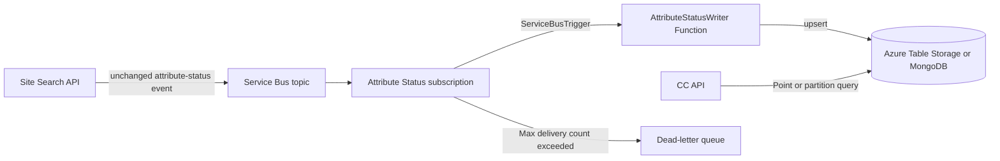

# AttributeStatusService: Azure implementation

## Decision

Use these Azure services for the primary implementation:

| GCP component | Azure component |
|---|---|
| Pub/Sub topic | Azure Service Bus topic |
| Pub/Sub subscriber / BigQuery writer | Java 21 Azure Function with a Service Bus topic subscription trigger |
| BigQuery current-status table | Azure Table Storage |
| BigQuery client in the CC API | `com.azure.data.tables.TableClient` |

An alternate implementation uses the same Service Bus-triggered Java Function
and writes to MongoDB with the MongoDB Java Sync Driver. On Azure, the preferred
managed MongoDB target is Azure Cosmos DB for MongoDB vCore. The same
implementation can target MongoDB Atlas or another compatible MongoDB service
by changing its connection configuration.

Messaging remains in the design. Although the expected load is low enough for
the Site Search API to write directly to Table Storage, doing so would change
the existing operational semantics by coupling the API to datastore
availability and removing asynchronous delivery, retries, and dead-lettering.

Azure Table Storage is preferred over Azure Cosmos DB for Table for this
low-volume workload. Both are supported by the Java
`com.azure:azure-data-tables` SDK, so Cosmos DB for Table remains a future
option if globally distributed reads, tighter latency guarantees, or higher
throughput become necessary.

The MongoDB implementation is an alternative datastore implementation, not a
replacement for Service Bus.

## Data flow



1. The Site Search API publishes the existing message contract to a Service
   Bus topic.
2. A dedicated subscription delivers each event to the Azure Function.
3. The Function validates the message and maps it to a table entity.
4. The Function writes through the `com.azure.data.tables.TableClient` API.
5. The trigger completes the Service Bus message only after the table write
   succeeds.
6. The CC API reads the current status from the table.

## Function shape

Use a Java 21 Azure Function and the following Maven dependencies:

- `com.microsoft.azure.functions:azure-functions-java-library`
- `com.azure:azure-data-tables`
- `com.azure:azure-identity`

The receiver should use the Service Bus trigger and call the Tables SDK
directly rather than use a table output binding. The direct API makes the
upsert mode, cancellation, failures, and concurrency behavior explicit.

```java
@FunctionName("AttributeStatusWriter")
public void run(
    @ServiceBusTopicTrigger(
        name = "message",
        topicName = "%AttributeStatusTopicName%",
        subscriptionName = "%AttributeStatusSubscriptionName%",
        connection = "ServiceBusConnection")
    String message,
    @BindingName("MessageId")
    String sourceMessageId,
    ExecutionContext context) {

    AttributeStatusEvent status = deserializeAndValidate(message);
    TableEntity entity = mapToEntity(status, sourceMessageId);
    tableClient.upsertEntity(entity, TableEntityUpdateMode.REPLACE);
}
```

Do not catch storage or deserialization failures and return success. An
unhandled failure causes Service Bus to retry the message. After the
subscription's maximum delivery count is reached, Service Bus moves it to the
subscription dead-letter queue.

## Alternate MongoDB target

Use the same Java Function trigger and message contract, replacing only the
persistence adapter. Add this Maven dependency:

- `org.mongodb:mongodb-driver-sync`

Define a small persistence boundary so the trigger behavior is identical for
both targets:

```java
public interface AttributeStatusStore {
    void upsert(AttributeStatusEvent status, String sourceMessageId);
}
```

The MongoDB implementation performs a replacement upsert using the same
logical key as the Azure Tables implementation:

```java
public final class MongoAttributeStatusStore implements AttributeStatusStore {
    private final MongoCollection<Document> collection;

    @Override
    public void upsert(
        AttributeStatusEvent status,
        String sourceMessageId) {

        Document id = new Document("partitionKey", status.partitionKey())
            .append("rowKey", status.rowKey());

        Document replacement = status.toDocument()
            .append("_id", id)
            .append("sourceMessageId", sourceMessageId);

        collection.replaceOne(
            Filters.eq("_id", id),
            replacement,
            new ReplaceOptions().upsert(true));
    }
}
```

The deterministic compound `_id` makes duplicate Service Bus deliveries
idempotent. A MongoDB exception must escape the Function invocation so the
message is retried and eventually dead-lettered in exactly the same way as a
Tables API failure.

For a current-state collection, create the unique key through `_id` as shown.
For an append-only history collection, include the existing immutable event ID
or source timestamp in `_id`. Choose the form that matches the current BigQuery
behavior.

The CC API reads the document with the same logical key:

```java
Document id = new Document("partitionKey", partitionKey)
    .append("rowKey", rowKey);

Document status = collection.find(Filters.eq("_id", id)).first();
```

### MongoDB deployment configuration

| Setting | Purpose |
|---|---|
| `AttributeStatusMongoConnectionString` | MongoDB connection string, supplied through a secret reference when native identity is unavailable |
| `AttributeStatusMongoDatabase` | Database name |
| `AttributeStatusMongoCollection` | Collection name |

For Azure Cosmos DB for MongoDB vCore, use Microsoft Entra authentication and
the Function managed identity where supported by the selected cluster and
MongoDB Java driver versions. For a MongoDB service that requires credentials,
store the connection string in Azure Key Vault and expose it to the Function
through a Key Vault app-setting reference; do not store it in source or
deployment parameters.

Only one target adapter should consume the production subscription. Running a
Tables Function and MongoDB Function against the same subscription would make
them competing consumers, so each event would go to only one target. If a
temporary dual-write comparison is required, create a second Service Bus
subscription so each target receives every event.

## Entity design

The exact event payload and current BigQuery update behavior must remain
unchanged. Map the existing logical key to Azure Tables as follows:

| Table field | Value |
|---|---|
| `PartitionKey` | Existing site, tenant, or other bounded ownership key |
| `RowKey` | Existing attribute identifier |
| Status properties | Existing event fields without semantic changes |
| `SourceMessageId` | Service Bus `MessageId`, for diagnostics |
| `SourceUpdatedAt` | Existing source event timestamp |

Use deterministic `PartitionKey` and `RowKey` values. Service Bus provides
at-least-once delivery, so a retry of the same message must replace the same
entity rather than create a duplicate.

Azure Tables keys cannot contain `/`, `\`, `#`, or `?`, and control characters
are also invalid. If current identifiers can contain those characters, use one
stable reversible encoding consistently in both the Function and CC API.

### Current state versus history

This design assumes BigQuery currently represents one current row per logical
attribute and that incoming events update that row.

If BigQuery instead retains every status event, a single Table Storage upsert
would remove history and would not preserve semantics. In that case, retain
history by including the source event timestamp or immutable event ID in the
`RowKey`, and have the CC API query the appropriate partition for the latest
record. This behavior must be confirmed from the existing implementation
before finalizing the entity key.

## Ordering and duplicate delivery

Service Bus subscriptions are at-least-once and do not guarantee ordering
unless sessions are enabled.

- Set `MessageId` to the existing immutable event ID where one exists.
- Enable Service Bus duplicate detection on the topic.
- If updates for one attribute must be processed in order, enable sessions and
  set `SessionId` to the logical attribute key.
- Independently reject or conditionally handle stale events by comparing the
  source event timestamp. Sessions preserve broker order but do not protect
  against a producer publishing an older event later.

The stale-event rule must match the current GCP/BigQuery behavior; it must not
be introduced if the current implementation intentionally accepts
last-arriving writes.

## Configuration

Use settings rather than hard-coded resource names:

| Setting | Purpose |
|---|---|
| `AttributeStatusTopicName` | Service Bus topic name |
| `AttributeStatusSubscriptionName` | Function subscription name |
| `ServiceBusConnection__fullyQualifiedNamespace` | Identity-based Service Bus namespace, such as `example.servicebus.windows.net` |
| `AttributeStatusTableServiceUri` | Table service endpoint, such as `https://example.table.core.windows.net` |
| `AttributeStatusTableName` | Attribute status table name |
| `AttributeStatusTarget` | Selected persistence adapter: `tables` or `mongodb` |

For local development only, connection-string settings can be supported
separately. Production should use managed identity.

## Identity and access

Assign the Function's managed identity:

- `Azure Service Bus Data Receiver` scoped to the subscription, topic, or
  namespace as narrowly as deployment tooling permits.
- For the Tables target, `Storage Table Data Contributor` scoped to the storage
  account.
- For the MongoDB target, the database role required to replace and insert
  documents in the selected collection.

Assign the CC API's managed identity:

- For the Tables target, `Storage Table Data Reader` scoped to the storage
  account.
- For the MongoDB target, a read-only database role for the selected
  collection.

Assign the Site Search API's managed identity:

- `Azure Service Bus Data Sender` scoped to the topic or namespace.

No component needs a storage account key or Service Bus connection string in
production.

## Reliability and operations

- Configure an explicit subscription maximum delivery count and lock duration.
- Alert on active-message age, dead-letter count, Function failures, and Table
  Storage throttling.
- Preserve Service Bus `MessageId`, correlation ID, and source timestamp in
  structured logs.
- Do not auto-forward or discard dead-letter messages without an operational
  replay process.
- Keep Function concurrency conservative initially; expected volume is low and
  consistency is more important than throughput.

## Acceptance criteria outcome

**Alternatives to BigQuery:** The primary recommendation is Azure Table
Storage, accessed through the Azure Tables API. A supported alternate
implementation writes the same event to Azure Cosmos DB for MongoDB vCore or
another MongoDB-compatible target using the MongoDB Java driver.

**Is messaging necessary:** Yes, to preserve the current asynchronous
Pub/Sub-based operational semantics. The Azure equivalent is a Service Bus
topic and subscription consumed by an Azure Function. Direct writes from the
Site Search API are technically possible but are not selected because they
would change failure isolation, retry, and delivery behavior.
