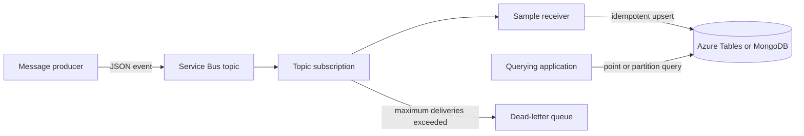

# Azure Service Bus message persistence sample

## Purpose

This document describes a generic reference pattern for moving JSON messages
from an Azure Service Bus topic subscription into a queryable datastore.

It is not a production design or a drop-in migration. Adopting teams must
provide their own message contract, logical keys, authorization boundaries,
operational limits, and data-retention rules.

## Component mapping

| Messaging and analytics pattern | Azure sample component |
|---|---|
| Publish/subscribe topic | Azure Service Bus topic |
| Message subscriber | Java Azure Function, Micronaut worker, or Logic Apps Standard workflow |
| Current-state key/value store | Azure Table Storage |
| Alternate document store | Azure Cosmos DB for MongoDB vCore or another MongoDB-compatible service |
| Data reader | Application using the Azure Tables or MongoDB client |

Messaging remains useful even for low-volume workloads because it separates
producer availability from datastore availability and provides retries,
dead-lettering, and independent consumers.

## Sample data flow



1. A producer publishes a JSON event to a Service Bus topic.
2. A dedicated subscription delivers the event to one sample receiver.
3. The receiver validates the configured logical keys.
4. The receiver performs a deterministic datastore upsert.
5. The message is completed only after the datastore write succeeds.
6. Failures are retried and can eventually reach the dead-letter queue.

## Available samples

### Java Azure Function

The Java 21 Function uses `@ServiceBusTopicTrigger` and writes through the
`com.azure.data.tables.TableClient` or MongoDB Java driver.

The direct datastore APIs make update mode, errors, cancellation, and
concurrency visible in code.

### Micronaut worker

The Micronaut Java 21 worker uses `ServiceBusProcessorClient`, explicit
peek-lock settlement, dependency injection, managed lifecycle, and Kubernetes
health endpoints.

### Logic Apps Standard

The no-code sample uses the built-in `receiveTopicMessages` Service Bus trigger
and Azure Tables `upsertEntity` action. It runs on the Logic Apps workflow
runtime through `Microsoft.Azure.Functions.ExtensionBundle.Workflows`.

For Kubernetes, the sample packages the workflow runtime in an Azure Functions
container and uses KEDA to scale from the Service Bus subscription. This is an
experimental, community-supported hosting option. The Dockerfile and manifests
are under `samples/logic-app-standard/kubernetes`.

## Datastore choices

### Azure Table Storage

Azure Table Storage is a low-cost option when reads are based on deterministic
partition and row keys. The Java samples use `com.azure:azure-data-tables`.

Example entity mapping:

| Table property | Sample value |
|---|---|
| `PartitionKey` | Configured ownership or grouping field |
| `RowKey` | Configured entity identifier |
| `Payload` | Original JSON message |
| `SourceMessageId` | Service Bus message ID |
| `SourceEnqueuedAt` | Service Bus enqueue timestamp |

Azure Tables keys cannot contain `/`, `\`, `#`, `?`, or control characters.
Either reject such keys or apply one stable encoding in both writers and
readers.

### MongoDB

The MongoDB adapter stores the original JSON payload and uses a deterministic
compound `_id` containing the logical partition and row keys.

```java
Document id = new Document("partitionKey", partitionKey)
    .append("rowKey", rowKey);

collection.replaceOne(
    Filters.eq("_id", id),
    replacement,
    new ReplaceOptions().upsert(true));
```

The same sample can target Azure Cosmos DB for MongoDB vCore, MongoDB Atlas, or
another compatible service through connection configuration.

## Current state versus event history

The samples demonstrate a current-state upsert: repeated messages for one
logical key replace the same record.

An append-only event store needs a different key containing an immutable event
ID or source timestamp. The reader must then query and select the appropriate
event. Choose one model before adapting the sample.

## Duplicate delivery and ordering

Service Bus provides at-least-once delivery. Deterministic keys make a retry
replace the same record rather than create a duplicate.

- Set `MessageId` to an immutable event ID where possible.
- Enable duplicate detection when appropriate.
- Use sessions when messages for one logical entity must be processed in broker
  order.
- Add a source-timestamp rule only if the adopting system needs stale-event
  rejection.

Do not deploy multiple alternative receivers against one subscription unless
they are intended to compete for messages. For side-by-side evaluation, create
one subscription per receiver.

## Identity and access

Typical managed-identity roles are:

| Component | Role |
|---|---|
| Message producer | `Azure Service Bus Data Sender` |
| Receiver | `Azure Service Bus Data Receiver` |
| Azure Tables receiver | `Storage Table Data Contributor` |
| Azure Tables reader | `Storage Table Data Reader` |
| MongoDB receiver or reader | Least-privilege database role for the selected collection |

Use connection strings only for local development or when the selected service
does not support the required identity mechanism. Store production secrets in
Azure Key Vault or an equivalent secret manager.

## Production adaptation checklist

Before using any sample:

1. Replace the example message schema and key fields.
2. Decide between current-state upserts and append-only history.
3. Define ordering, duplicate, and stale-event behavior.
4. Configure topic and subscription delivery limits.
5. Provision the datastore and indexes.
6. Apply least-privilege managed identities.
7. Add monitoring for failures, message age, dead letters, and throttling.
8. Load-test the selected runtime and datastore.

## Conclusion

Azure Table Storage is the simplest low-volume key/value alternative shown in
this repository. MongoDB is provided as a document-store variation. Service Bus
remains in the sample to demonstrate asynchronous delivery, failure isolation,
retry, and dead-letter behavior.
